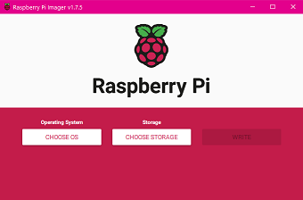
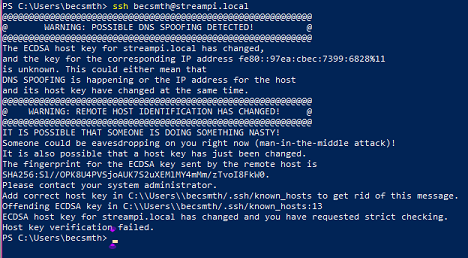

#### *Dedicated to my dad, Michael Otto Fredenburg, USMC 1948-2022*

# The MICD Device  
A Multi-Impairment Communication Device

The MICD device eases communication for people who have difficulty communicating using messages sent from a Stream Deck user to a mobile phone and web application.

I originally created this using a basic 3D printed button box for my dad pictured below. 


v2 has been upgraded the the Stream Deck:


### *Core Contributors:*
* [Rebecca Smith](https://www.linkedin.com/in/rebecca-smith101/) Project Lead Python Stream Deck application and IoT Connection
* [Max Tybar](https://www.linkedin.com/in/maxtybar/) Lead AWS CDK & Web App
* [Kyle Jones](https://www.linkedin.com/in/kyle-t-jones/) Architecture, Documentation


In this project you will be connecting a Raspberry Pi to an Elgato Stream Deck. The project is deployed in the AWS Cloud using the AWS Cloud Development Kit (AWS CDK). The Elgato Stream Deck is utilized to send messages to AWS IoT Core over MQTT using a Raspberry Pi, an AWS Amplify web application is deployed, data is stored in Amazon DynamoDB, and text message are sent to an end user via Amazon SNS.

### Architecture


### Hardware requirements
* Raspberry Pi (tested on Raspberry Pi 4 and Raspberry Pi Zero W)
* MicroSD card
* Power supply for Raspberry Pi (Power cord or battery)
* Elgato Stream Deck ( tested with Mini, Original, and Pedal)

### Software and Library requirements
* Raspberry Pi Imager https://www.raspberrypi.com/software/
* Python 3.9 or later


### Prerequsites

An AWS Account with programmatic access with permissions to use AWS Services, create IAM roles and policies used in this project.\
We recommend using an IAM role and assuming the role in your terminal.

1. [Create](https://docs.aws.amazon.com/IAM/latest/UserGuide/id_roles_use_switch-role-twp.html) an IAM Role in the AWS Console.

2. Install the AWS Command Line Interface (AWS CLI)
   - [Getting Started](https://docs.aws.amazon.com/cli/latest/userguide/cli-chap-getting-started.html) with AWS CLI.

   - How to [switch roles](https://docs.aws.amazon.com/IAM/latest/UserGuide/id_roles_use_switch-role-cli.html) using the AWS CLI.

## *Important* 
You will need an [Orgination Number](https://docs.aws.amazon.com/sns/latest/dg/channels-sms-originating-identities-origination-numbers.html) from AWS Simple Notification Service to use the text messaging feature of this project. Depending on what type of Origination Number you need, this process can be completed right away or take take up to 15 business days.

### This is a 7 part project. 

## Part 1.
**Format the microSD card for the Raspberry Pi**

Windows:


To open Command Prompt on Windows, go to Windows search
-Search:
```sh
 CMD
```

In the command line paste the following commands:

1. 
    ```sh
    DISKPART        
    ```
2.
    ```sh
    list disk
    ```
    

#### 3. Format disk.
Make sure you select the correct disk number, this is a destructive process and will completely erase every thing on the disk. 

```sh
select disk <number>

clean 

create partition primary

format fs=FAT32
```


After formatting your microSD card the next step is to install the operating system the that will run on the Raspberry Pi.


## Part 2. Install Raspberry Pi Operating System on the MicroSD Card.

Set up Secure Shell (ssh) and wifi to automatically connect the Raspberry Pi to the Wifi network. This enables a headless setup (accessing without connecting the Pi to a display, mouse and keyboard).

1. Start the Raspberry Pi Imager



2. Choose Operating System (OS)
* **Raspberry Pi OS (LEGACY)**


3. Choose Storage:
* Select your **microSD card**


**4. Settings:**
* Select the **Settings Gear Icon** to set up the Raspberry Pi.


* Set a **hostname** to ssh into your Raspberry Pi for headless setup.
    - streampi
* **Enable SSH**
    * Use password **authentication** or you can set up a public key if you prefer.


* **Username & Password**
    - Set your **username and password** used to log into your pi

* **Configure Wireless**


* **Time Settings:**


**4. Now your ready to Write to to the microSD card**


## Part 3. Connecting to the Rapberry Pi

**1. Insert the microSD card into the Pi.**
* Shown here is a Raspberry Pi 4 and Raspberry Pi Zero W
    


**2. Plug the power cord in to power the Pi.**


The device should automatically connect to your WiFi based on the credentials you supplied earlier. 

**3. Now we will ssh into the Pi**
* Using the hostname you gave your Pi, enter the folling into your terminal.
```sh
ssh <username>@<hostname.local>
```


 **Here are some common issues you may run into:**



**This can come up if you have set up pi with the same IP address or hostname,  erased your sd card and are setting up a new pi.**

To fix, we need to remove the old ssh key. By running the following command:
```sh
ssh-keygen -R [hostname] 
```
For Example:
```sh
ssh-keygen -R raspberrypi.local 
```


You can locate your hostname/IP address uisng your router's admin protal if needed.

**4. Let's enable VNC viewer now. It the teminal, enter the following to open Rasperry Pi Configuration Tool:**
```sh
sudo raspi-config
```
1. Select Interface Options


2. Select VNC 

3. Select Enable


4. Select:
    * Display Options
    * Select Resolution 
    


5. Select finish, then reboot.


Finished with Part 3

## Part 4. 

Install dependencies:

#### Ensure system is up to date, upgrade all out of date packages
```sh
sudo apt update && sudo apt dist-upgrade -y
```
#### Install the pip Python package manager
```sh
sudo apt install -y python3-pip python3-setuptools
```
#### Install system packages needed for the default LibUSB HIDAPI backend
```sh
sudo apt install -y libudev-dev libusb-1.0-0-dev libhidapi-libusb0
```

#### Install system packages needed for the Python Pillow package installation
```sh
sudo apt install -y libjpeg-dev zlib1g-dev libopenjp2-7 libtiff5
```

#### Install python library dependencies
```sh
pip3 install wheel pillow AWSIoTPythonSDK
```
#### Add udev rule to allow all users non-root access to Elgato StreamDeck devices:
```sh
sudo tee /etc/udev/rules.d/10-streamdeck.rules << EOF
    SUBSYSTEMS=="usb", ATTRS{idVendor}=="0fd9", GROUP="users", TAG+="uaccess"
    EOF
```
OR

```sh
cd /etc/udev/rules.d
```

```sh
sudo nano 50-streamdeck.rules
```
```sh
SUBSYSTEM=="input", GROUP="input", MODE="0666"

# infinitton
SUBSYSTEM=="usb", ATTRS{idVendor}=="ffff", ATTRS{idProduct}=="1f40", MODE:="666", GROUP="plugdev"
KERNEL=="hidraw*", ATTRS{idVendor}=="ffff", ATTRS{idProduct}=="1f40", MODE:="666", GROUP="plugdev"
SUBSYSTEM=="usb", ATTRS{idVendor}=="ffff", ATTRS{idProduct}=="1f41", MODE:="666", GROUP="plugdev"
KERNEL=="hidraw*", ATTRS{idVendor}=="ffff", ATTRS{idProduct}=="1f41", MODE:="666", GROUP="plugdev"

# streamdeck
SUBSYSTEMS=="usb", ATTRS{idVendor}=="0fd9", GROUP="users", TAG+="uaccess"
SUBSYSTEM=="usb", ATTRS{idVendor}=="0fd9", ATTRS{idProduct}=="0060", MODE:="666", GROUP="plugdev"
SUBSYSTEM=="usb", ATTRS{idVendor}=="0fd9", ATTRS{idProduct}=="0063", MODE:="666", GROUP="plugdev"
SUBSYSTEM=="usb", ATTRS{idVendor}=="0fd9", ATTRS{idProduct}=="006c", MODE:="666", GROUP="plugdev"
SUBSYSTEM=="usb", ATTRS{idVendor}=="0fd9", ATTRS{idProduct}=="006d", MODE:="666", GROUP="plugdev"
SUBSYSTEM=="usb", ATTRS{idVendor}=="0fd9", ATTRS{idProduct}=="0080", MODE:="666", GROUP="plugdev"
SUBSYSTEM=="usb", ATTRS{idVendor}=="0fd9", ATTRS{idProduct}=="0084", MODE:="666", GROUP="plugdev"
SUBSYSTEM=="usb", ATTRS{idVendor}=="0fd9", ATTRS{idProduct}=="0086", MODE:="666", GROUP="plugdev"
SUBSYSTEM=="usb", ATTRS{idVendor}=="0fd9", ATTRS{idProduct}=="008f", MODE:="666", GROUP="plugdev"
SUBSYSTEM=="usb", ATTRS{idVendor}=="0fd9", ATTRS{idProduct}=="0090", MODE:="666", GROUP="plugdev"
KERNEL=="hidraw*", ATTRS{idVendor}=="0fd9", ATTRS{idProduct}=="0060", MODE:="666", GROUP="plugdev"
KERNEL=="hidraw*", ATTRS{idVendor}=="0fd9", ATTRS{idProduct}=="0063", MODE:="666", GROUP="plugdev"
KERNEL=="hidraw*", ATTRS{idVendor}=="0fd9", ATTRS{idProduct}=="006c", MODE:="666", GROUP="plugdev"
KERNEL=="hidraw*", ATTRS{idVendor}=="0fd9", ATTRS{idProduct}=="006d", MODE:="666", GROUP="plugdev"
KERNEL=="hidraw*", ATTRS{idVendor}=="0fd9", ATTRS{idProduct}=="0080", MODE:="666", GROUP="plugdev"
KERNEL=="hidraw*", ATTRS{idVendor}=="0fd9", ATTRS{idProduct}=="0084", MODE:="666", GROUP="plugdev"
KERNEL=="hidraw*", ATTRS{idVendor}=="0fd9", ATTRS{idProduct}=="0086", MODE:="666", GROUP="plugdev"
KERNEL=="hidraw*", ATTRS{idVendor}=="0fd9", ATTRS{idProduct}=="008f", MODE:="666", GROUP="plugdev"
KERNEL=="hidraw*", ATTRS{idVendor}=="0fd9", ATTRS{idProduct}=="0090", MODE:="666", GROUP="plugdev"

# xkeys
SUBSYSTEM=="usb", ATTRS{idVendor}=="05f3", MODE:="666", GROUP="plugdev"
KERNEL=="hidraw*", ATTRS{idVendor}=="05f3", MODE:="666", GROUP="plugdev"

```
#### Reload udev rules to ensure the new permissions take effect
```sh
sudo udevadm control --reload-rules
```

#### Install the latest version of the StreamDeck library via pip
```sh
pip3 install streamdeck
```

## Part 5. Connecting to the Pi with VNC viewer and transfering files.

* 1. In the VNC viewer, enter your hostname, for example: streampi.local
* 2. Enter the password you set up in the Raspberry Pi Imager Part 2, step 4.

* 3. Use the file transfer feature to transfer the StreamdeckApp to your Raspberry Pi


* 4. Transfer your Streamdeckapp file to your raspberrypi

* 5. Open a terminal in your Raspberry Pi.

```sh
cd Desktop/streamdeckapp/

```

* 6. Create a file: "aws" and inside of aws "certs"
```sh
mkdir aws && cd aws

mkdir certs
```

* 7. Navigate to IoTCore and create a Thing, download the certs and save them in the certs directory on your pi. Your path (names of your certs files) should match the paths in the config.py file shown below.
    - Obtain your Endpoint while your are in IoT Core and copy it for later.
        - Endpoint is located in Settings
```
ROOT_CA = "aws/certs/root-CA.crt"
PRIVATE_KEY = "aws/certs/private.key"
CERTIFICATE = "aws/certs/certificate.pem"
CLIENT_ID = "MICD_15"

```
* 8. Navigate to the src folder and open the config.py file to enter your IoT Core Endpoint found in Settings in IoT Core.

```sh
cd src
```

```sh
sudo nano config.py

```

enter your endpoint here:

```sh
HOST = <"SomeRandomNumbers-ats.iot.<Region>.amazonaws.com">

```

* 9. Run the script:

```sh
cd streamdeckapp

```

```sh
python3 main.py

```

* 10. After running the script you will be promted to enter a username. 


* 11. Press a button on your Streamdeck to obtain the topic from the terminal. Save this for later, you will need it in Part 7.


After delploying the CDK file below, you will need to make some rules in IoT Core to route your messages from the streamdeck to DynamoDB and Amazon Simple Notification Service for email or text to phone. 
    - The instructions will be listed after the CDK deployment part. 

## Part 6. Steps for CDK Deployment:


* 1. Before you proceed, make sure you store a secret key from this Github repo inside the Secrets Manager in the region where you deploy the solution.

* 2. Substitute <> fields with your values and execute this command in the terminal/command line:

```sh
ADMIN_EMAIL=<admin_email>
ADMIN_GIVEN_NAME=<admin_given_name>
ADMIN_FAMILY_NAME=<admin_family_name>
PATIENT_EMAIL=<patient_email>
PATIENT_GIVEN_NAME=<patient_given_name>
PATIENT_FAMILY_NAME=<patient_family_name>

```
* 3. Run the following command to deploy the cdk:


```sh
cdk deploy --all --require-approval never -c admin_email=$ADMIN_EMAIL -c admin_given_name=$ADMIN_GIVEN_NAME -c admin_family_name=$ADMIN_FAMILY_NAME -c patient_email=$PATIENT_EMAIL -c patient_given_name=$PATIENT_GIVEN_NAME -c patient_family_name=$PATIENT_FAMILY_NAME

```
* 4. From the cdk outputs copy AppStack.CognitoIdentityPoolId variable (it will have some randomly generated numbers at the end). Paste it in <> field and run the following command:

```sh
COGNITO_IDENTITY_POOL_ID=<.....CognitoIdentityPoolId.....>

```
* 5. Go to the Amplify console. Open 'MICD_App', and click on the link. You will be redirected to the registration page. Login using 

#### (!IMPORTANT) password and username that you received in the patient's email. Change your password.


* 6. After that, from the command line run the following command:


```sh
IDENTITY_ID=$(aws cognito-identity list-identities --identity-pool-id $COGNITO_IDENTITY_POOL_ID --max-results 1 | jq -r '.Identities[0].IdentityId') && aws iot attach-policy --policy-name PubSubPolicy --target $IDENTITY_ID

```

### *Deletion steps:*

1. From the command line run: 
```sh
aws iot detach-policy --policy-name PubSubPolicy --target $IDENTITY_ID
```
2. From the deploy folder inside the project run:
```sh
cdk destroy --force -c patient_given_name=$PATIENT_GIVEN_NAME
```

## Part 7. Setting up Rules for IoT Core:

* 1. Copy the IoT Core topic you save in earlier. 
    - Navigate to IoT Core to to Message Routing
    - Select Rules
* 2. You will create two rules in this section. The first for Amazon SNS, and the second for DynamoDB

    - Create the SNS rule, then repeat the same steps for the DynamoDB Table. 

    - Name
```sh
Streamdeck_to_SNS
```
- Enter the SQL Statement

* This SQL Statement for SNS
```
SELECT VALUE Message FROM '<MICD/StreamDeckMini/rebecca/Button1>' # Use the topic name your retrieved from your Raspberry Pi Terminal.

```

* This SQL Statement for DynamoDB
```
SELECT * FROM FROM '<MICD/StreamDeckMini/rebecca/Button1>' # Use the topic name your retrieved from your Raspberry Pi Terminal. The final entry for the topic should look like this: 'MICD/StreamDeckMini/rebecca/Button1'

```
- Select the action 

    - Simple Notification Service - for the SNS Rule creation
    - DynamoDBv2 - for the DynamoDB table Rule

- Choose a topic or a DynamoDB Table
    - You Will need to create a topic in SNS in this step.

- Add an IAM Role with permissions to Publish to SNS and one for DynamoDB to PutItem.

- Set up your Subscriber in SNS, you can choose email or text or both. Text requires addtional setup steps. 
